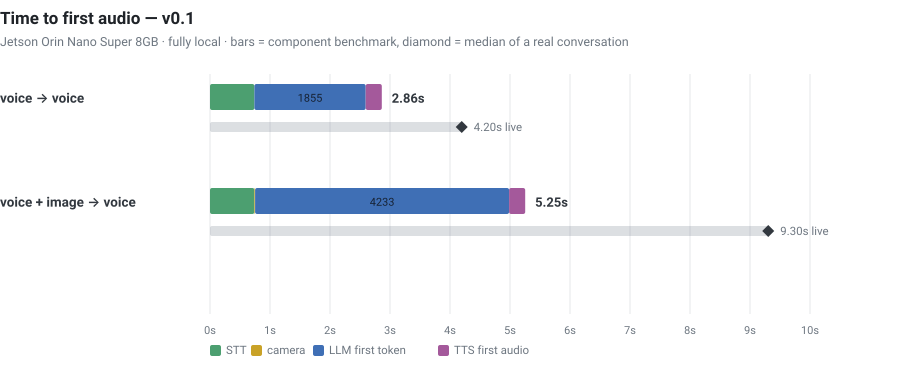

# voice-companion

A voice + vision assistant that runs **entirely on an NVIDIA Jetson Orin Nano Super (8 GB)**.
No cloud APIs, no network calls at inference time. You talk, it looks when asked, it talks back.

```
mic ──▶ VAD ──▶ STT ──▶ [camera, only when asked] ──▶ VLM ──▶ TTS ──▶ speaker
                                                       │
                                     per-turn stage latencies ──▶ CSV
```

---

## Time to first audio — v0.1

### ▶ [Open the interactive dashboard](https://similas.github.io/voice-companion/)

Hover any stage for its share of the turn, toggle stages on and off, switch between the
isolated benchmark and the live conversation, and hover individual turns to see what was
said and what came back. The image below is a static fallback — GitHub sanitizes HTML in
READMEs, so the interactive version has to live on Pages.

<a href="https://similas.github.io/voice-companion/">
  
</a>

| path | benchmark (components) | live conversation (median) |
|---|---|---|
| **voice → voice** | **2.86 s** | **4.20 s** |
| **voice + image → voice** | **5.25 s** | **9.30 s** |

Two numbers because they answer different questions. The **benchmark** figure runs each
stage in isolation — the floor this hardware can do. The **live** figure is the median of a
real 16-turn conversation, where Whisper, Piper, the camera thread and Ollama all compete
for 6 CPU cores. The gap between them *is* the contention cost, and it is the main thing
v0.2 should attack.

Stage medians, measured:

| stage | text turn | vision turn |
|---|---|---|
| STT (whisper tiny, int8) | 739 ms | 739 ms |
| camera capture + JPEG | — | 13 ms |
| **LLM first token** | **1855 ms** | **4233 ms** |
| TTS first audio (piper) | 268 ms | 268 ms |
| generation rate | 16.0 tok/s | 16.3 tok/s |

The LLM dominates: 65% of a text turn, 81% of a vision turn. Attaching an image costs
**+2.4 s of prefill** — Gemma 3's vision encoder plus 256 image tokens. Capturing the frame
is free (13 ms); sending a smaller image does not help, because Gemma 3 resizes to a fixed
896×896 internally.

---

## Stack

| role | choice | notes |
|---|---|---|
| Orchestration | **Pipecat 0.0.108** | pinned — 1.x needs `onnxruntime~=1.24.3`, which has no aarch64 wheel |
| STT | **faster-whisper `tiny`**, int8, CPU | CTranslate2 backend; `base` was 1369 ms vs 739 ms for the same text |
| Brain (text + vision) | **Gemma 3 4B** via **Ollama**, Q4_K_M | one model for both; 100% GPU-offloaded |
| TTS | **Piper**, `en_US-lessac-medium` | 0.09× realtime, CPU |
| VAD / turn-taking | **Silero VAD** (onnxruntime) | 0.5 s of silence ends your turn |
| Audio I/O | **PortAudio** → **PipeWire** → A2DP | PortAudio cannot see Bluetooth sinks directly |
| Vision capture | **OpenCV** + **V4L2**, MJPEG | frame kept fresh by a background drain thread |

**No PyTorch.** faster-whisper uses CTranslate2 and Silero VAD uses onnxruntime, which
saves roughly 2 GB on an 8 GB budget.

### Hardware

| | |
|---|---|
| Compute | Jetson Orin Nano Super 8 GB — 6× Cortex-A78AE, Ampere GPU (1024 CUDA cores, cc 8.7) |
| Memory | 7.4 GB **unified** — system RAM *is* GPU RAM |
| OS | JetPack 6.2 / L4T R36.4.4, Ubuntu 22.04, kernel 5.15.148-tegra |
| Camera + mic | EMEET SmartCam C960 (USB, 1080p30 MJPEG, built-in mic) |
| Speaker | Bluetooth A2DP (SBC) |
| Runtime | CUDA 12.6, TensorRT 10.3, Python 3.10 |

### Protocols

| link | protocol |
|---|---|
| LLM | HTTP + SSE streaming to Ollama (`/api/chat`, OpenAI-compatible `/v1` via Pipecat) |
| Images | base64 JPEG data URI inside the chat message |
| Audio out | PortAudio → PipeWire → **Bluetooth A2DP/SBC** |
| Audio in | V4L2/ALSA → PipeWire → PortAudio, 16 kHz mono PCM |
| Camera | V4L2 MJPEG, 1280×720, downscaled to 896 px longest edge |
| Remote camera view | MJPEG over HTTP `multipart/x-mixed-replace`; streaming WAV for audio |

---

## Memory, and the trap

Unified memory means **system RAM is GPU RAM**. If too little is free when Ollama loads the
model, it silently offloads **zero layers to the GPU** and runs on CPU — same answers, several
times slower, no error. Seen in Ollama's own log:

```
CUDA0 (Orin) | 7619 total = 1689 free + (623 self) + 5307 unaccounted
load_tensors: offloaded 0/35 layers to GPU        ← on CPU
```

Even with 4.8 GB free, Ollama's estimator left 20% of layers on the CPU. Forcing all of them
on is worth 100% GPU, +10% throughput, and 600 MB less RAM:

```bash
printf 'FROM gemma3:4b\nPARAMETER num_ctx 2048\nPARAMETER num_gpu 99\n' > Modelfile
ollama create gemma3:4b-jetson -f Modelfile
```

| | offload | tok/s | resident |
|---|---|---|---|
| `gemma3:4b` | 80% GPU | 14.7 | 3.5 GB |
| `gemma3:4b-jetson` | **100% GPU** | **16.1** | **2.9 GB** |

Check it with `ollama ps` — you want `100% GPU`. `tools/check_env.py` verifies this for you.

---

## Vision only when asked

An image costs +2.4 s, so the camera is used only when your words imply it. Two mechanisms:
a configurable phrase list, plus a generic test (a question about your body, clothing,
surroundings, or a held object) and **sticky follow-ups** — after a vision turn, "how about
now?" looks again instead of guessing.

**Trigger accuracy: 17/17** on utterances taken from a real conversation.

There is also a hard invariant: **at most one image in the context, belonging to the turn that
asked for it.** Without it, a VLM answers later questions from a stale photo as though it were
live — observed answering "what colour is my shirt?" from a frame captured four turns earlier,
with no new capture taken.

---

## Quality metrics

| metric | v0.1 |
|---|---|
| STT word error rate | 11.3% mean, 5.6% median |
| STT exact-match rate | 50% (4 of 8 prompts verbatim) |
| Vision trigger accuracy | 17/17 (100%) |
| LLM throughput | 16.0 tok/s text, 16.3 tok/s vision |
| Camera frame freshness | 254 ms median |
| Encoded frame sent to the VLM | 896×503, 66 KB |

WER is measured against Piper-synthesised prompts, not human speech — a reproducible proxy,
not a claim about anyone's accent. Errors are dominated by numeral formatting ("2" vs "two")
and punctuation, so the mean overstates how wrong it sounds; the per-prompt transcripts are
in `benchmark.json` under `stt.examples` if you want to judge for yourself.

---

## Layout

```
app/
  main.py       pipeline assembly, EchoGate, NoiseGate, VisionGate
  stt.py        Whisper with hallucination suppression
  vision.py     camera drain thread + "should I look?" classifier
  metrics.py    per-turn latency records, CSV, SpeakingState
  observer.py   passive Pipecat observer that timestamps every stage
  config.py     config loading
config.yaml     every model, device and threshold, with measurements in comments
bench/
  benchmark.py  component + end-to-end benchmark (no human needed)
  make_chart.py renders the TTFA chart from results
  results/v0.1/ benchmark.json, ttfa.svg, and the live session it is compared against
tools/
  check_env.py  environment doctor; --list-audio for PyAudio indices
  selftest.py   exercises everything except the microphone
  bt_speaker.sh pair/connect a Bluetooth speaker
```

---

## Run

```bash
python3 -m virtualenv ~/.venvs/voice-companion
~/.venvs/voice-companion/bin/pip install -r requirements.txt
~/.venvs/voice-companion/bin/python -m piper.download_voices \
    en_US-lessac-medium --data-dir models
ollama pull gemma3:4b

python tools/check_env.py     # health check first
./run.sh                      # foreground
./watch.sh                    # follow turns + latencies
./stop.sh
```

The venv lives **outside** the project on purpose: `nltk` 3.10 refuses to import anything
located under the current working directory, so a `./.venv` makes every dependency
unimportable.

Reproduce the benchmark and regenerate both charts:

```bash
python bench/benchmark.py      --reps 3 --tag v0.1   # measure
python bench/make_chart.py     --tag v0.1            # static SVG for this README
python bench/make_dashboard.py --tag v0.1            # interactive docs/index.html
```

`docs/index.html` is self-contained — data inlined as JSON, no CDN, no build step — so it
also works opened straight from disk:

```bash
python3 -m http.server 8081 --directory docs   # then open http://localhost:8081
```

---

## Known limits in v0.1

- **No barge-in.** With one room speaker and no acoustic echo cancellation, "user interrupting"
  and "bot hearing itself" are the same signal. Mic is closed while the bot talks.
- **Omnidirectional mic hears the TV.** It transcribed background dialogue and answered it.
  Partly mitigated by VAD thresholds (`vad.confidence` / `vad.min_volume`), but that trades
  directly against hearing *you* — the thresholds shipped here are not tuned to any specific
  voice. A beamforming array (reSpeaker XVF3800) is the real fix.
- **No tools, so no live data.** Ask about today's weather and it will deflect or invent.
- **Vision turns are slow** (5–9 s). The dominant cost is Gemma 3's vision encoder.
- **STT is CPU-only.** CTranslate2 ships no CUDA build for Jetson.
