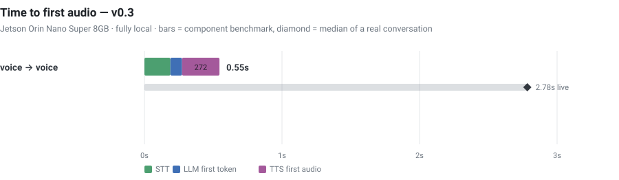
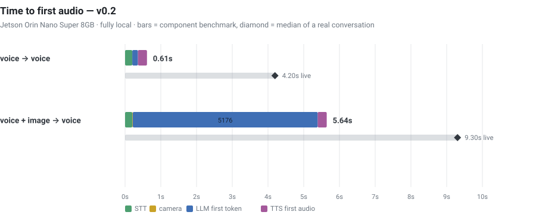

# voice-companion

A voice + vision assistant that runs **entirely on an NVIDIA Jetson Orin Nano Super (8 GB)**.
No cloud APIs, no network calls at inference time. You talk, it looks when asked, it talks back.

```
mic ──▶ VAD ──▶ STT ──▶ [camera, only when asked] ──▶ VLM ──▶ TTS ──▶ speaker
                                                       │
                                     per-turn stage latencies ──▶ CSV
```

---

## Time to first audio — v0.3

### ▶ [Open the interactive dashboard](https://similas.github.io/voice-companion/)

<p align="center">
  
</p>

| | v0.1 | v0.2 | **v0.3** |
|---|---|---|---|
| composed TTFA (voice→voice) | 2891 ms | 613 ms | **545 ms** |
| STT wait after turn end | 736 ms | 202 ms | **189 ms** |
| LLM first token | 1855 ms | 158 ms | **85 ms** |
| generation | 15.1 tok/s | 17.5 tok/s | **30.4 tok/s** |
| live TTFA, real room, median of 22 turns | — | not recorded | **2784 ms** |

The composed and live numbers are both real and they are not the same number.
Composed is what the stages cost with the machine to themselves; live adds VAD
close (0.8 s), a growing prompt, CPU contention, and playback pacing on a 7.6 GB
board doing everything at once. v0.3 is the first version honest enough to print
both.

### What v0.3 actually is

v0.2 chased speed. v0.3 chased the truth, and most of what it found was load-bearing:

- **The LLM client was pointed at the wrong server.** It resolved, logged, and
  warmed up llama-server — then built its client against Ollama's port from a
  stale config default. Every turn made Ollama load a second 3 GB model + 942 MB
  vision projector next to ours. On unified memory that froze the box hard enough
  to need the plug pulled, four times, and looked exactly like "the agent is deaf".
- **`ollama stop` allocates.** It is a generate request with `keep_alive=0`, so
  the launcher's "free the GPU first" step was *loading* a model to unload it.
  Removed; Ollama is disabled entirely — llama.cpp's server is driven directly.
- **All swap on this board is zram** — compressed RAM. Under pressure it thrashes
  to a standstill *before* the OOM killer can act, which is why nothing was ever
  killed and no log was ever written. The stack now runs in a systemd slice with
  a hard `MemoryMax`, swap denied, core dumps off, and an explicit OOM kill
  order: llama-server first, agent second, sshd never. Verified by running an
  unbounded allocator inside the slice while serving — the session survived.
  Full story: [docs/memory.md](docs/memory.md).
- **Model: gemma-4-E2B (QAT q4_0) via llama-server.** 30.4 tok/s, TTFT 85 ms.
  It is a reasoning model, so `--reasoning off` is load-bearing: without it the
  first audible word waits on an invisible thinking block.
- **Mic: reSpeaker XVF3800 4-mic array** (flashed to USB-audio firmware — the
  XIAO bundle ships in I2S mode and is invisible over USB until reflashed).
  Measured against the webcam mic in the same room: speech 2.2× stronger, noise
  floor 3× lower, ~17 dB SNR improvement, native 16 kHz.
- **Utterances no longer lose their first word.** VAD spends 0.2 s deciding you
  are speaking and used to discard that audio ("Tell me a joke" → "me a joke").
  A 0.6 s pre-roll ring now backfills it — and the same ring fixed an unbounded
  idle buffer that grew the agent to 2.3 GB overnight.
- **The mic reopens 0.3 s after a reply, not ~5 s.** The echo gate books how long
  the speaker will actually make sound; it was triple-counting because the
  observer sees each frame at ~12 pipeline hops (and frame ids are not stable
  across hops, so dedupe-by-id silently failed). Audio is now counted at exactly
  one link — into the output transport. A turn you start a beat too early is
  held and replayed instead of destroyed.
- **Two agents can no longer run at once.** A kernel `flock` in run.sh. Two
  instances answering each other through the room speaker reads exactly like
  "the bot hears itself", and cost an evening.

### Previous — v0.2

Hover any stage for its share of the turn, toggle stages on and off, switch between the
isolated benchmark and the live conversation, and hover individual turns to see what was
said and what came back. The image below is a static fallback — GitHub sanitizes HTML in
READMEs, so the interactive version has to live on Pages.

<a href="https://similas.github.io/voice-companion/">
  
</a>

| stage | v0.1 | *step 1* | **v0.2** |
|---|---|---|---|
| STT wait after you stop | 739 ms | 742 ms | **218 ms** |
| LLM first token | 1855 ms | 158 ms | **158 ms** |
| TTS first audio | 268 ms | 257 ms | **253 ms** |
| **voice → voice TTFA** | **2862 ms** | **1157 ms** | **613 ms** |

**4.7× faster than v0.1**, from two changes. The middle column is an intermediate
measurement (`bench/results/v0.2-step1-llama-server/`) taken after the first change and
before the second — it was never released, but the numbers are kept because they show
which change bought which milliseconds.

**1. llama-server instead of Ollama** — 1855 → 158 ms.
Ollama is a wrapper around llama.cpp: it ships the same `llama-server` binary and proxies
to it. That hop cost ~1.1-1.7 s per request here, independent of model size (1B and 4B
within 30 ms of each other) and of prompt length (13 words to 1354 words varied by 50 ms).
Same GGUF, same weights — only the request path changed.

**2. Speculative STT** — 736 → 218 ms, **at zero accuracy cost**.
Turn detection holds `stop_secs` (0.5 s) of silence before ending your turn, so a thinking
pause does not cut you off. That window is dead time by construction, and your speech is
already finished when it starts — so Whisper runs *then*:

```
last sound ─▶ VAD STOPPING ─▶ [decode here] ─▶ turn confirmed ─▶ transcript ready
```

It is the same computation on the same audio, moved earlier — not an approximation.
Verified over 8 prompts: transcripts **byte-identical 8/8**, WER 9.96% → 9.96%,
9 speculation hits and 0 misses. If you resume talking the guess is discarded.

**What did NOT work, measured rather than assumed:** classic streaming STT — decode partial
windows during speech, commit segments closed off by internal silence — came out **slower:
714 ms → 1074 ms with zero commits.** Utterances to a voice assistant are 2-4 s of
continuous speech with no internal pauses to commit at. Right idea for dictation, wrong
workload here.

**3. Clause-level TTS.** Pipecat waits for `. ! ?` before synthesising, so
"The capital of France is Paris, and it has about two million people." stayed silent for
all 68 characters. Breaking on the first clause (and on a word boundary near 46 chars when
there is no punctuation) cut the mean first chunk 50 → 30 chars, ~293 ms earlier audio.
Only the first chunk is cut short; later ones use full sentences, which sound better.

Vision is deliberately untouched in v0.2 at ~5.6 s — that cost is Gemma 3's SigLIP
encoder, and the focus was the voice path.

\* **The vision figures are not comparable across versions.** v0.1's 5.25 s was measured
with a flawed method: the benchmark repeated each (prompt, image) pair, and repeats hit
llama.cpp's exact-prefix cache, which returns in ~300 ms and is not vision latency. v0.2
uses a distinct frame per call. Measured honestly with distinct frames and distinct
questions, llama-server is still ~1.4 s faster than Ollama on vision
(~5.05 s vs ~6.45 s VLM TTFT) — the same overhead removal, just swamped by the encoder.

The dashboard also shows a **live** column: medians from a real 16-turn conversation, where
STT, TTS, the camera thread and the model all compete for 6 CPU cores. **Those numbers are
from v0.1 and have not been re-measured** — a live re-run needs a person talking, not a
benchmark. Treat the benchmark figures as the hardware floor and the live ones as the
v0.1-era ceiling; the truth for v0.2 sits between and is not yet recorded.

Stage medians, measured:

| stage | text turn | vision turn |
|---|---|---|
| STT wait (whisper tiny, int8, speculative) | 218 ms | 218 ms |
| camera capture + JPEG | — | 13 ms |
| **LLM first token** | **158 ms** | **5176 ms** |
| TTS first audio (piper) | 253 ms | 253 ms |
| generation rate | 17.5 tok/s | 17.3 tok/s |

A text turn is now well balanced — 36% STT, 26% LLM, 41% TTS — with no single dominant
cost left. Raw Whisper decode is still 752 ms; speculation hides 550 ms of it inside the
VAD hangover.

Vision is dominated entirely by Gemma 3's SigLIP encoder — **~4.5 s** of it, measured by
comparing a fresh frame against a cache hit. The 268 image tokens it produces add only
~330 ms of prefill. Capturing the frame is free (13 ms), and sending a smaller image does
not help because Gemma 3 resizes to a fixed 896×896 internally.

---

## Stack

| role | choice | notes |
|---|---|---|
| Orchestration | **Pipecat 0.0.108** | pinned — 1.x needs `onnxruntime~=1.24.3`, which has no aarch64 wheel |
| Inference server | **llama.cpp `llama-server`**, run directly | 91% lower TTFT than Ollama; `tools/llama_server.sh` |
| STT | **faster-whisper `tiny`**, int8, CPU | CTranslate2 backend, decoded speculatively during the VAD hangover |
| Brain (text + vision) | **Gemma 3 4B**, Q4_K_M | one model for both; 100% GPU-offloaded. GGUF reused from Ollama's store |
| TTS | **Piper**, `en_US-lessac-medium` | 0.09× realtime, CPU |
| VAD / turn-taking | **Silero VAD** (onnxruntime) | 0.5 s of silence ends your turn; `STOPPING` triggers speculative STT |
| Audio I/O | **PortAudio** → **PipeWire** → A2DP | PortAudio cannot see Bluetooth sinks directly |
| Vision capture | **OpenCV** + **V4L2**, MJPEG | frame kept fresh by a background drain thread |

**No PyTorch.** faster-whisper uses CTranslate2 and Silero VAD uses onnxruntime, which
saves roughly 2 GB on an 8 GB budget.

### Hardware

| | |
|---|---|
| Compute | Jetson Orin Nano Super 8 GB — 6× Cortex-A78AE, Ampere GPU (1024 CUDA cores, cc 8.7) |
| Memory | 7.4 GB **unified** — system RAM *is* GPU RAM |
| OS | JetPack 6.2 / L4T R36.4.4, Ubuntu 22.04, kernel 5.15.148-tegra |
| Camera + mic | EMEET SmartCam C960 (USB, 1080p30 MJPEG, built-in mic) |
| Speaker | Bluetooth A2DP (SBC) |
| Runtime | CUDA 12.6, TensorRT 10.3, Python 3.10 |

### Protocols

| link | protocol |
|---|---|
| LLM | HTTP + SSE streaming, OpenAI-compatible `/v1/chat/completions` (llama-server, or Ollama) |
| Images | base64 JPEG data URI inside the chat message |
| Audio out | PortAudio → PipeWire → **Bluetooth A2DP/SBC** |
| Audio in | V4L2/ALSA → PipeWire → PortAudio, 16 kHz mono PCM |
| Camera | V4L2 MJPEG, 1280×720, downscaled to 896 px longest edge |
| Remote camera view | MJPEG over HTTP `multipart/x-mixed-replace`; streaming WAV for audio |

---

## Memory, and the trap

This section describes the **Ollama** backend, which is still selectable via
`llm.backend: ollama`. With `llama_server` (the default) you pass `--n-gpu-layers 99`
explicitly, so there is no estimator to second-guess — but the underlying memory constraint
is identical, and `llama-server` has its own silent-CPU-fallback trap documented in
`tools/llama_server.sh`.

Unified memory means **system RAM is GPU RAM**. If too little is free when Ollama loads the
model, it silently offloads **zero layers to the GPU** and runs on CPU — same answers, several
times slower, no error. Seen in Ollama's own log:

```
CUDA0 (Orin) | 7619 total = 1689 free + (623 self) + 5307 unaccounted
load_tensors: offloaded 0/35 layers to GPU        ← on CPU
```

Even with 4.8 GB free, Ollama's estimator left 20% of layers on the CPU. Forcing all of them
on is worth 100% GPU, +10% throughput, and 600 MB less RAM:

```bash
printf 'FROM gemma3:4b\nPARAMETER num_ctx 2048\nPARAMETER num_gpu 99\n' > Modelfile
ollama create gemma3:4b-jetson -f Modelfile
```

| | offload | tok/s | resident |
|---|---|---|---|
| `gemma3:4b` | 80% GPU | 14.7 | 3.5 GB |
| `gemma3:4b-jetson` | **100% GPU** | **16.1** | **2.9 GB** |

Check it with `ollama ps` — you want `100% GPU`. `tools/check_env.py` verifies this for you.

---

## Vision only when asked

An image costs **~4.5 s**, so the camera is used only when your words imply it. Two mechanisms:
a configurable phrase list, plus a generic test (a question about your body, clothing,
surroundings, or a held object) and **sticky follow-ups** — after a vision turn, "how about
now?" looks again instead of guessing.

**Trigger accuracy: 17/17** on utterances taken from a real conversation.

There is also a hard invariant: **at most one image in the context, belonging to the turn that
asked for it.** Without it, a VLM answers later questions from a stale photo as though it were
live — observed answering "what colour is my shirt?" from a frame captured four turns earlier,
with no new capture taken.

---

## Quality metrics

| metric | v0.1 | v0.2 |
|---|---|---|
| STT word error rate | 11.3% mean | **9.96% mean** (identical with speculation) |
| STT exact-match rate | 50% | **62%** (5 of 8 verbatim) |
| Vision trigger accuracy | 17/17 | **17/17** (100%) |
| LLM throughput | 16.0 tok/s | **17.6 tok/s** |
| Camera frame freshness | 254 ms | 1444 ms† |
| Encoded frame sent to the VLM | 896×503, 66 KB | 896×503, 69 KB |

† Frame age rose on purpose. v0.2 drains the camera at 0.4 fps when idle instead of 2 fps,
because that MJPEG decode was competing with Whisper and the model for 6 cores on every
turn — including the ~80% that never look at the camera. It jumps back to 4 fps for 25 s
after any vision turn, so follow-ups still get a fresh frame.

WER is measured against Piper-synthesised prompts, not human speech — a reproducible proxy,
not a claim about anyone's accent. Errors are dominated by numeral formatting ("2" vs "two")
and punctuation, so the mean overstates how wrong it sounds; the per-prompt transcripts are
in `benchmark.json` under `stt.examples` if you want to judge for yourself.

---

## Layout

```
app/
  main.py       pipeline assembly, EchoGate, NoiseGate, VisionGate, ImageMerger
  stt_stream.py speculative Whisper — decodes during the VAD hangover
  vad_hook.py   Silero wrapper that reports the STOPPING edge
  tts_stream.py clause-level aggregation so speech starts on the first clause
  stt.py        non-speculative Whisper with hallucination suppression (fallback)
  vision.py     camera drain thread + "should I look?" classifier
  metrics.py    per-turn latency records, CSV, FIFO turn attribution
  observer.py   passive Pipecat observer that timestamps every stage
  config.py     config loading
config.yaml     every model, device and threshold, with measurements in comments
bench/
  benchmark.py  component + end-to-end benchmark (no human needed)
  make_chart.py renders the TTFA chart from results
  results/v0.1/ benchmark.json, ttfa.svg, and the live session it is compared against
tools/
  llama_server.sh  start/stop the llama.cpp server (refuses a silent CPU-only start)
  check_env.py  environment doctor; --list-audio for PyAudio indices
  selftest.py   exercises everything except the microphone
  bt_speaker.sh pair/connect a Bluetooth speaker
```

---

## Run

```bash
python3 -m virtualenv ~/.venvs/voice-companion
~/.venvs/voice-companion/bin/pip install -r requirements.txt
~/.venvs/voice-companion/bin/python -m piper.download_voices \
    en_US-lessac-medium --data-dir models

# LLM weights. Not in the repo — 3.3 GB, and a verbatim copy of a published file.
mkdir -p models && curl -L --fail -o models/gemma-4-E2B-q4_0.gguf \
  https://huggingface.co/google/gemma-4-E2B-it-qat-q4_0-gguf/resolve/main/gemma-4-E2B_q4_0-it.gguf

tools/llama_server.sh start   # llama.cpp server, with the memory guard
python tools/check_env.py      # health check
./run.sh                       # foreground
./watch.sh                     # follow turns + latencies
./stop.sh
```

The venv lives **outside** the project on purpose: `nltk` 3.10 refuses to import anything
located under the current working directory, so a `./.venv` makes every dependency
unimportable.

Reproduce the benchmark and regenerate both charts:

```bash
python bench/benchmark.py      --reps 3 --tag v0.1   # measure
python bench/make_chart.py     --tag v0.1            # static SVG for this README
python bench/make_dashboard.py --tag v0.1            # interactive docs/index.html
```

`docs/index.html` is self-contained — data inlined as JSON, no CDN, no build step — so it
also works opened straight from disk:

```bash
python3 -m http.server 8081 --directory docs   # then open http://localhost:8081
```

---

## Known limits in v0.1

- **No barge-in.** With one room speaker and no acoustic echo cancellation, "user interrupting"
  and "bot hearing itself" are the same signal. Mic is closed while the bot talks.
- **Omnidirectional mic hears the TV.** It transcribed background dialogue and answered it.
  Partly mitigated by VAD thresholds (`vad.confidence` / `vad.min_volume`), but that trades
  directly against hearing *you* — the thresholds shipped here are not tuned to any specific
  voice. A beamforming array (reSpeaker XVF3800) is the real fix.
- **No tools, so no live data.** Ask about today's weather and it will deflect or invent.
- **Vision turns are slow** (5–9 s). The dominant cost is Gemma 3's vision encoder.
- **STT is CPU-only.** CTranslate2 ships no CUDA build for Jetson.
